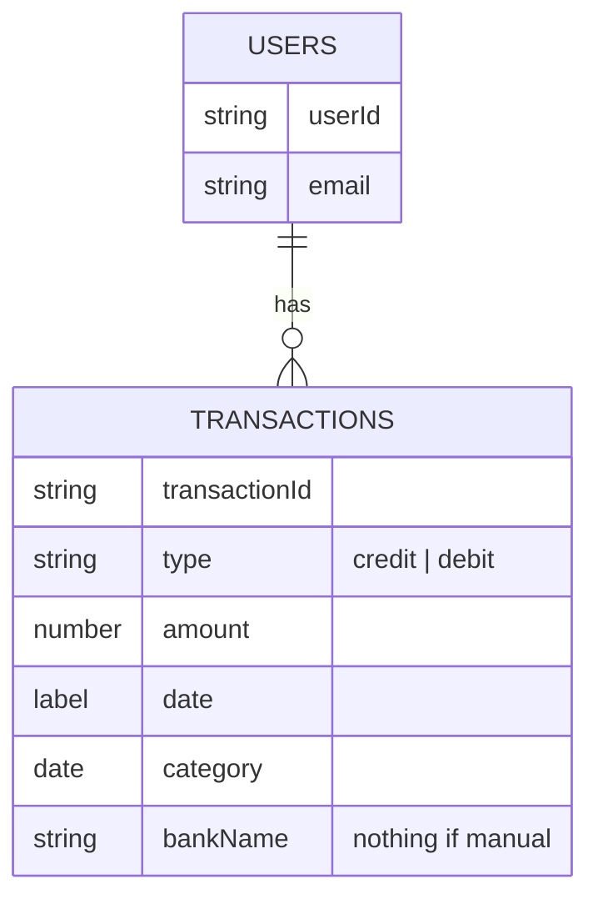

# Personnal finances tracker application

## Functionnal requirements
- Offline and online mode
- CRUD on online profile
- CRUD on transactions
  - Manually add a transaction
  - Hide (ignore) some transactions fetched from a bank API
- Automatic fetching of transactions from a bank API
- Data visualization
- Create financial goals **optional**
- Automatic categorization of transactions **optional**
- Grocery list scanning and granular categorization **optional**
- Associate a bill photo to a transaction **optional**
- Reccurent transactions **optional**
- Multiple currencies support **optional**
- Multi language support **optional**

## Non functionnal requirements
- Compatibility: support for Android and IOS
- Usability: aim for the least amount of manual input
- Utility: provide useful insights and statistics
- Integration: integrate with at least one bank APIs to automatically fetch 
transactions

## Data structure

{
  "User": {
    "userId": "Unique identifier for the user",
    "name": "User's name",
    "email": "User's email",
    "transactions": [
      {
        "transactionId": "Unique identifier for the transaction",
        "type": "credit/debit",
        "amount": "Transaction amount",
        "date": "Transaction date",
        "category": "Transaction category",
        "label": "A descriptive label for the transaction",
        "origin": {
          "type": "manual/bank",
          "bankName": "Name of the bank if the origin is a bank"
        },
        "details": {
          "products": [
            {
              "productName": "Name of the product",
              "productNameTranslated": "Translated name of the product",
              "quantity": "Product quantity",
              "price": "Product price",
              "category": "Product category"
            },
            // More products
          ]
        }
      },
      // More transactions
    ]
  }
}

## Estimation of monthly resources consumption for 1 user
https://www.statista.com/statistics/893459/average-number-of-transactions-per-person-per-day-by-method/
Median number of transactions per user per day in the EURO area is 1.6.\
Monthly number of transactions per user: 1.6 * 29.53 = 47.25\
Size of a transaction without products: 450 bytes\
Size of a transaction with 30 products: 3790 bytes\
If a user makes 47.25 transactions per month (with 6 transactions of 30 
products), the monthly disk resources consumption will be 41.3 KB.

## Estimation of monthly resources consumption for 100 000 users
Monthly disk resources consumption for 1 user: 41.3 KB\
Monthly disk resources consumption for 100 000 users: 4.13 GB\
If each user makes 100 reads and 100 writes per month, the monthly\ 
