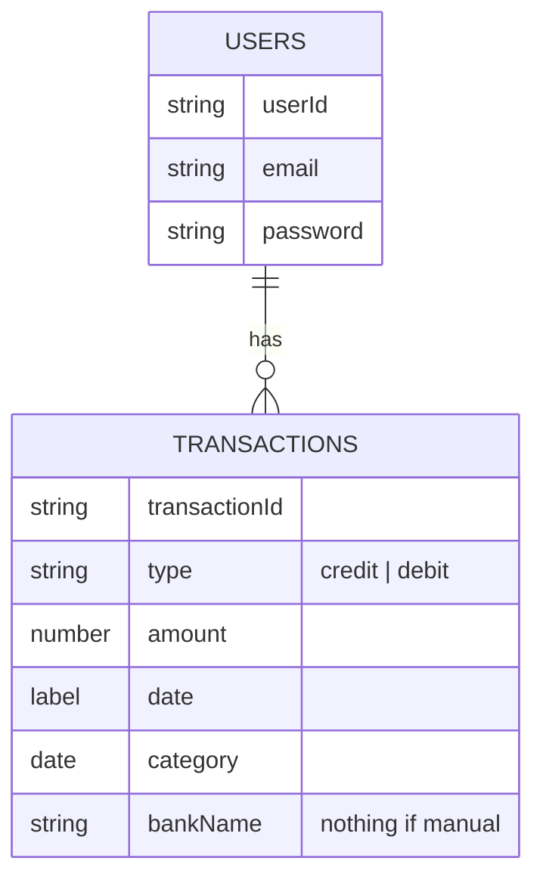

# Personnal finances tracker application

## Functionnal requirements
- Offline and online mode
- CRUD on online profile
- CRUD on transactions
  - Manually add a transaction
  - Hide (ignore) some transactions fetched from a bank API
- Automatic fetching of transactions from a bank API
- Data visualization
- Create financial goals **optional**
- Automatic categorization of transactions **optional**
- Grocery list scanning and granular categorization **optional**
- Associate a bill photo to a transaction **optional**
- Reccurent transactions **optional**
- Multiple currencies support **optional**
- Multi language support **optional**

## Non functionnal requirements
- Compatibility: support for Android and IOS
- Usability: aim for the least amount of manual input
- Utility: provide useful insights and statistics
- Integration: integrate with at least one bank APIs to automatically fetch 
transactions

## Data structure


```json
{
  "User": {
    "userId": "Unique identifier for the user",
    "email": "User's email",
    "password": "User's password",
    "transactions": [
      {
        "transactionId": "Unique identifier for the transaction",
        "type": "credit/debit",
        "amount": "Transaction amount",
        "date": "Transaction date",
        "category": "Transaction category",
        "label": "A descriptive label for the transaction",
        "bankName": "Name of the bank if the origin is a bank"
      }
    ]
  }
}
```

## Estimation of monthly resources consumption for 1 user
https://www.statista.com/statistics/893459/average-number-of-transactions-per-person-per-day-by-method/
Median number of transactions per user per day in the EURO area is 1.6.\
Monthly number of transactions per user: 1.6 * 29.53 = 47.25\
Size of a transaction without products: 450 bytes\
Size of a transaction with 30 products: 3790 bytes\
If a user makes 47.25 transactions per month (with 6 transactions of 30 
products), the monthly disk resources consumption will be 41.3 KB.

Cost of the openai vision api with the gtp-4o model  :
// 1k tokens = 1k tokens of input and 1k tokens of output
Input : $0.005 / 1K tokens
Output : $0.015 / 1K tokens
Max token for one picture : 300
Cost for one picture : 0.005 + 0.015 = 0.02 / 3.33 = 0.006 $

For 1 picture per day : 0.006 * 30 = 0.18 $ / month

For 10k users : 1800 $

Very expensive, we need to put a paywall for this feature.

## Diagrams
### C4 Container diagram


